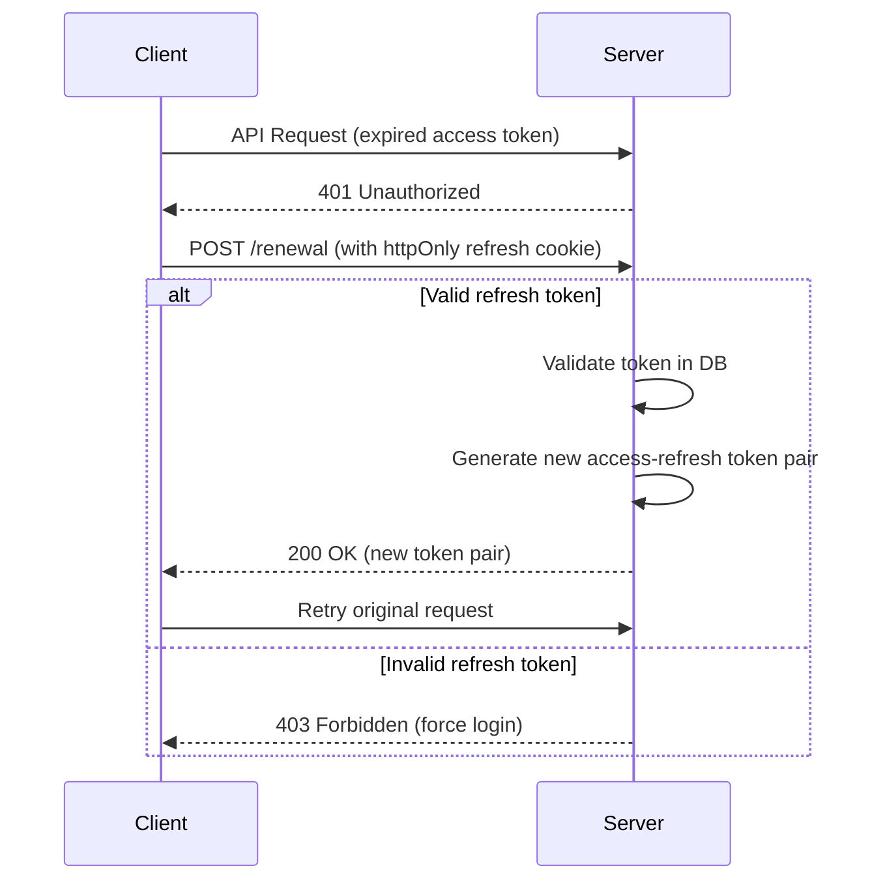

# OATHenticate 🔐

**OATHenticate** is a secure, modular and responsive user authentication application featuring a rotating refresh token mechanism for enhanced session security. 

Built with **React + TypeScript + Tailwind** on the frontend and **Express + TypeScript** on the backend, using MongoDB for storing the tokens and the users.


## 🚀 Key Features

### 🔄 **Rotating Tokens**
- Configurable token lifespan and refresh windows.
- Prevent token reuse and session hijacking with automatic token renewal.
- JWT-based authentication with access/refresh token rotation.
- Short-lived access tokens in browser storage.
- Long-lived refresh tokens in HTTP-only cookies.
- Secure token revocation.

### 🏗️ **Architecture**
- Clear separation of concerns, easy to extend and to maintain.
- Easily can be pluged into other services to improve the security of an app.
- TypeScript interfaces for all core components.

### 🌐 **Frontend**
- Smooth UX through the seamless handling of token renewal with retries of the original request.
- Responsive UI with Tailwind CSS.
- Optimized performance with code splitting.
- Modern React hooks architecture.

## 🧰 Tech Stack

### Frontend:
- [React](https://reactjs.org/) + [TypeScript](https://www.typescriptlang.org/)
- [Axios](https://axios-http.com/) for API calls
- [React Router](https://reactrouter.com/) for routing

### Backend:
- [Express](https://expressjs.com/) + [TypeScript](https://www.typescriptlang.org/)
- [jsonwebtoken](https://github.com/auth0/node-jsonwebtoken)
- [bcrypt](https://github.com/kelektiv/node.bcrypt.js)
- [mongoose](https://mongoosejs.com)

## 📦 Installation

### Clone the repo
```bash
git clone https://github.com/yourusername/OATHenticate.git
cd OATHenticate
```

## 🔐 Back-end
### 1. Install dependencies
```bash
cd ./auth-backend
npm i
```

### 2. Configure environmental variables 
Create a **.env** / **.env.development** file to hold the environmental variables for the application.

**NOTE**: A MongoDB URI is needed, in order for the connection to be established.

⚠️ For production deployments, ensure HTTPS is used and secrets are stored securely (e.g. via a vault or secret manager).

An example .env file:

```bash
# Environmental variables
PORT = '5000'
FRONT_BASE_URI = 'http://localhost:3000'
MONGO_URI = 'YOUR_MONGO_URI'

JWT_SECRET = 'YOUR_JWT_SECRET_HERE'
REFRESH_SECRET = 'YOUR_REFRESH_SECRET_HERE'

# Expiry in minutes
JWT_EXPIRATION = 5
REFRESH_EXPIRATION = 60
```

3. Run the back-end
```bash
npx nodemon
```

## 🔑 Front-end

### 1. Install dependencies
```bash
cd ./auth-frontend
npm i
```

### 2. Configure environmental variables 
Create a **.env** file to hold the environmental variables for the application.

An example .env file:

```bash
# Environmental variables
VITE_BASE_API_URI = "http://localhost:5000"
```

3. Run the front-end
```bash
npm run dev
```

## 🔄 Flow Diagram


## 🧾 License

This project is licensed under the MIT License.

## 🤝 Contributing

Contributions are welcome! Please open issues or submit a pull request.
